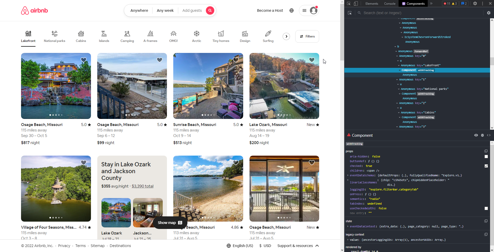
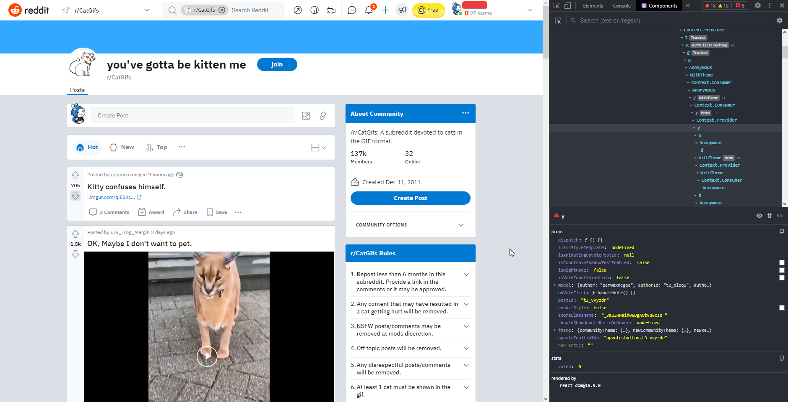

# Week 5

## Explain the pros and cons of using simple components vs stateful components

Simple components are components that don't have any state while stateful
components have states. States describe the component after changes. An example
of a state is a button recording a state of if the button is pressed or hovered
over.

## Compare and contrast React, Vue, and Angular

React

- Developed by Facebook
- Uses JSX

Vue

- Developed by ex-Google employee Evan You
- Integratable into existing apps
- Lightweight and flexible

Angular 2

- Developed by Google
- TypeScript framework
- Highly opionated (dictates how project is structured and code is written)

## In your own words what is a component?

A component is a reusable chunk of UI code that can be combined together with
other components to create larger applications.

## Visit <https://www.airbnb.com/> take some time to list out what is likely a component and provide screenshots and explanations of why

The buttons for different rental types are likely a component as they all have
same styling, props, and state. Based off the loggingID the name of the
component is likely categoryTab.

## Visit <https://www.reddit.com/r/CatGifs/> take some time to list out what is likely a component and provide screenshots and explanations of why

The upvote/downvote buttons with the number of votes are likely a component as
they all have same styling, props, and state. Though they aren't identified as
components in the developer tools and have no loggingID like on AirBnb.

## Using your answers to #4 and #5 can you explain which components were easier to pick out and why?

The AirBnb buttons were easier to identify due to the developer tools labeling
them as components.

## Is one site easier to identify components than the other? If so, why?

The components on the AirBnb site were easier to identify as the developer tools
explicitly identified them as components.

## In your own words can you explain what conditional rendering is and why it is important?

Conditional rendering is rendering a component based on a condition. For example
on a form if the user has entered a valid email address then the submit button
should be enabled, otherwise it should be disabled.

## When do you need to provide the key attribute on an element and why?

Key attributes are required when creating lists of elements. The keys are used
to identify which element is updated and needs to be re-rendered.

## How would you pass custom parameters to event handlers in React?

To pass custom parameters to event handlers in React you need to use the arrow
function syntax.

## In your own Words can you define what a Higher Order Component is?

Higher order components are functions that take in a component and return a
new component.

## Using <https://reactjs.org/docs/thinking-in-react.html> list all the different steps starting at “Start with a Mock” and explain what each step is IN YOUR OWN WORDS

1. Break the mockup design into components. Repetitive patterns or designs that
   will be repeated should be broken into components. Examples include
   TextFields or Buttons with custom logic or styling required. Give the
   components logical names based off their purpose.
2. Create a static version of the site in React meaning not to worry about the
   logic, state, responsiveness, or interactivity of the site yet. Each
   component at this point only needs a `render()` method.
3. Think of what will evolve or change through the use of the site. The
   searchbar of the site is an example of something that will change through use
   and need to be recorded in the state.
4. Begin implementing state into the UI. Identify which component each state
   belongs to. The searchbar value example from the previous step is a state
   that could live on a TextField component.
5. Data now needs to be able to flow up the hierarchy. Parent components can
   bind to the `onChange` event of their children to run any logic needed when
   a state change occurs.

## What are proptypes and how can they be helpful?

PropTypes are a way to validate the props of a component. They are used to
validate the type of props that are passed to a component. The syntax is similar
to TypeScript. This can help prevent errors and lead to easier debugging.

## Do some self-study on JSX and document your notes

JSX is a syntax extension for JavaScript that allows you to write HTML inside
JavaScript. By being able to write HTML directly in JavaScript it leads to
cleaner code. JSX also prevents cross-site scripting attacks by sanitizing
values before rendering.
